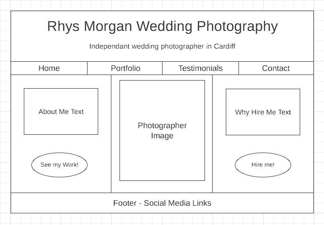
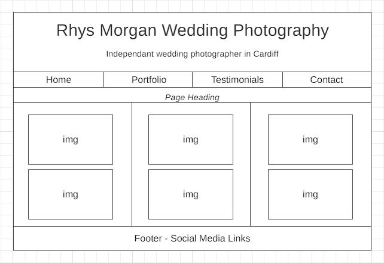
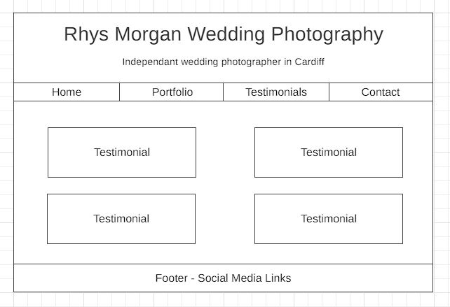
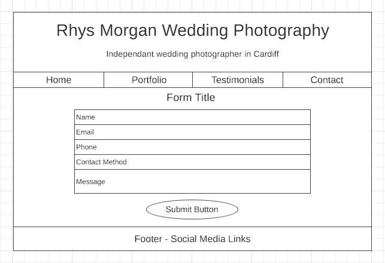

# Wedding Photographer Website

by Scott Edwards

[Click here to view the live website.](https://scotte13.github.io/Photographer-Website/)

Website developed for educational purposes as part of the Code Institute diploma in web development.

- - -

# Project Goals

## Purpose

The idea for this website was advertisement for a self-employed businessperson. This was a fictional career for the purpsoes of the project. The career chosen was a Wedding Photographer. The name of the photographer, 'Rhys Morgan', is made up. 

## Client Aims

The client aim is to ultimatley to obtain business. The website is a form of advertisement. It needs to provide information on the photography serivce, display a portoflio of work and provide methods of contact for potenntial customers. 

## User Aims

Users are the site are envisioned to be primarily people who are searching for a photographer for themselves or someone else. In addition friends, fans, clients and photography fans may view the site. 

## User Stories

1) As someone searching for a photogrpaher to hire I want to:

- Obtain an overview of the photographer and their service.
- View examples of the photographers work.
- Read reviews of the photographer.
- Be able to contact the photographer for more information, to ask questions or to request a booking. 
- Find links to social media accounts to connect with the photographer.

2) As a friend, fan or previous client I want to:

- View examples of the photographers work.
- Find links to social media accounts to connect with the photographer.
- View the testimonial if I have written one for the photographer. 

3) As a photography fan I want to:

- Obtain an overview of the photographer and their work.
- View examples of the photographers work.
- Be able to contact the photographer to discuss their work.
- Find links to social media accounts to connect with the photographer.

## Project Scope

The Scope of this project was to deliver a basic website that meets the client and user goals outlined above. In order to stay within this scope the basic site structure was planed in advance to outline the key pages required to meet the outlined goals. The visual design work for the project will also be kept to the minimum needed for the site to be functional and meet its goals. Additional functionality, content, design and features could be added in the future but will not form part of this release.

- - -

# Design & Structure

## Project Structure

The basic structure of the website was planned to include the following pages.

- Home page providing a photo of the photographer and basic about information.
- Portfolio page to display examples of work. 
- Testimonials page to display reviews from prior customers.
- Contact page to allow people to request business and ask any questions they may have. 

One additional page was added during development which was a thank you page following form submission. 

## Wireframes

Simple wireframes for the website pages were drawn up using [wireframe.cc](https://wireframe.cc/)

Home

Portfolio

Testimonials

Contact

 

## Visual Design

The goal for this project was to produce a simple and functional visual design with which the website would meet the project goals. 

### Colours

The colors of White, Black and a Dark Silver were chosen. Silver is a color often associated with Weddings. The colors are very functional and provide clear contrast with each other. The dark silver stands out nicely and is used to indicate the interactive elements of the website, such as links.

### Fonts

Fonts were sourced using Google Fonts.
The 'Exo' font was chosen as the base font for the website, as it is a strong and clear font that easily readable.
The 'Redressed' was used sparingly to add a more elegant font in some places.

- - -

# Technologies Used

- HMTL
- CSS
- Git
- Git Hub
- Git Pod
- Bootstrap 5.3
- Google Fonts
- Font Awesome

- - -

# Testing

## Validation Checks

### HTML

All HTML pages were checked using the [W3C Validator](https://validator.w3.org/).

- The validator picked up duplicated body tags on all HTML pages. These were removed.
- The validator returned that an "a" element should not be a descendant of a "button" element. To fix this issue I removed the button elements completley and instead applied styling to the links themselves.
- The validator picked up an unclosed semantic tag (nav) in the footer section across all pages. This was corrected.
- Unneccesary "/" characters were removed from input elements in the contact.html page. 
- No other HTML errors were detected.

### CSS

- The CSS style sheet was tested using [W3C Jigsaw Validator](https://jigsaw.w3.org/css-validator) and returned no errors.

## Manual Testing

 

The following manual functionality checks were carried out.

 

| Website Page| Expected Functionality    | Result of Test |
| ----------- | ----------- | ----------- |
| Index | The page title should work as a link back to the index.html page when clicked. | Functions as intended. |
| Index | Navbar 'Home' link loads the index.html page when clicked. | Functions as intended. |
| Index | Navbar 'Portfolio' link loads the portfolio.html page when clicked. | Functions as intended. |
| Index | Navbar 'Testimonials' link loads the testiomnials.html page when clicked.| Functions as intended. |
| Index | Navbar 'Contact' link loads the contact.html page when clicked. | Functions as intended. |
| Index | The four Navbar links change color on mouse hover. | Functions as intended. |
| Index | The 'See my work!' call to action link change color on mouse hover. | Functions as intended. |
| Index | The 'See my work!' call to action link loads the portfolio.html page when clicked. | Functions as intended. |
| Index | The 'Hire me!' call to action link change color on mouse hover. | Functions as intended. |
| Index | The 'Hire me!' call to action link loads the contact.html page when clicked. | Functions as intended. |
| Index | The footers Faceook icon opens a new tab and loads Facebook when clicked. | Functions as intended. |
| Index | The footers Twitter icon opens a new tab and loads Twitter when clicked.  | Functions as intended. |
| Index | The footers Instagram icon opens a new tab and loads Instagram when clicked.  | Functions as intended. |
| Index | The footers YouTube icon opens a new tab and loads YouTube when clicked.  | Functions as intended. |
| Index | The four social media icons change color on mouse hover. | Functions as intended. |
| Portfolio | The page title should work as a link back to the index.html page when clicked. | Functions as intended. |
| Portfolio | Navbar 'Home' link loads the index.html page when clicked. | Functions as intended. |
| Portfolio | Navbar 'Portfolio' link loads the portfolio.html page when clicked. | Functions as intended. |
| Portfolio | Navbar 'Testimonials' link loads the testiomnials.html page when clicked.| Functions as intended. |
| Portfolio | Navbar 'Contact' link loads the contact.html page when clicked. | Functions as intended. |
| Portfolio | The four Navbar links change color on mouse hover. | Functions as intended. |
| Portfolio | The footers Faceook icon opens a new tab and loads Facebook when clicked. | Functions as intended. |
| Portfolio | The footers Twitter icon opens a new tab and loads Twitter when clicked.  | Functions as intended. |
| Portfolio | The footers Instagram icon opens a new tab and loads Instagram when clicked.  | Functions as intended. |
| Portfolio | The footers YouTube icon opens a new tab and loads YouTube when clicked.  | Functions as intended. |
| Portfolio | The four social media icons change color on mouse hover. | Functions as intended. |
| Testimonials | The page title should work as a link back to the index.html page when clicked. | Functions as intended. |
| Testimonials | Navbar 'Home' link loads the index.html page when clicked. | Functions as intended. |
| Testimonials | Navbar 'Portfolio' link loads the portfolio.html page when clicked. | Functions as intended. |
| Testimonials | Navbar 'Testimonials' link loads the testiomnials.html page when clicked.| Functions as intended. |
| Testimonials | Navbar 'Contact' link loads the contact.html page when clicked. | Functions as intended. |
| Testimonials | The four Navbar links change color on mouse hover. | Functions as intended. |
| Testimonials | The footers Faceook icon opens a new tab and loads Facebook when clicked. | Functions as intended. |
| Testimonials | The footers Twitter icon opens a new tab and loads Twitter when clicked.  | Functions as intended. |
| Testimonials | The footers Instagram icon opens a new tab and loads Instagram when clicked.  | Functions as intended. |
| Testimonials | The footers YouTube icon opens a new tab and loads YouTube when clicked.  | Functions as intended. |
| Testimonials | The four social media icons change color on mouse hover. | Functions as intended. |
| Contact | The page title should work as a link back to the index.html page when clicked. | Functions as intended. |
| Contact | Navbar 'Home' link loads the index.html page when clicked. | Functions as intended. |
| Contact | Navbar 'Portfolio' link loads the portfolio.html page when clicked. | Functions as intended. |
| Contact | Navbar 'Testimonials' link loads the testiomnials.html page when clicked.| Functions as intended. |
| Contact | Navbar 'Contact' link loads the contact.html page when clicked. | Functions as intended. |
| Contact | The four Navbar links change color on mouse hover. | Functions as intended. |
| Contact | The user can input raw text in the forms name field. | Functions as intended. |
| Contact | The user can input raw text in the forms email field. | Functions as intended. |
| Contact | The user can input numbers only in the forms number field. | Functions as intended. |
| Contact | The user can input raw text in the forms contact method field. | Functions as intended. |
| Contact | The user can input raw text in the forms question field. | Functions as intended. |
| Contact | The 'Send Request' button will cause the page to display an error if any of the form fields are incomplete.| Functions as intended. |
| Contact | The 'Send Request' button will cause the page to display an error if the text in the email field is not in the format of an email address| Functions as intended. |
| Contact | The 'Send Request' button will load the thanks.html page if all form sections are completed correctly.| Functions as intended. |
| Contact | The footers Faceook icon opens a new tab and loads Facebook when clicked. | Functions as intended. |
| Contact | The footers Twitter icon opens a new tab and loads Twitter when clicked.  | Functions as intended. |
| Contact | The footers Instagram icon opens a new tab and loads Instagram when clicked.  | Functions as intended. |
| Contact | The footers YouTube icon opens a new tab and loads YouTube when clicked.  | Functions as intended. |
| Contact | The four social media icons change color on mouse hover. | Functions as intended. |
| Thanks | Navbar 'Home' link loads the index.html page when clicked. | Functions as intended. |
| Thanks | Navbar 'Portfolio' link loads the portfolio.html page when clicked. | Functions as intended. |
| Thanks | Navbar 'Testimonials' link loads the testiomnials.html page when clicked.| Functions as intended. |
| Thanks | Navbar 'Contact' link loads the contact.html page when clicked. | Functions as intended. |
| Thanks | The four Navbar links change color on mouse hover. | Functions as intended. |
| Thanks | The 'here' link in the text opens the index.html when clicked. | Functions as intended. |
| Thanks | The footers Faceook icon opens a new tab and loads Facebook when clicked. | Functions as intended. |
| Thanks | The footers Twitter icon opens a new tab and loads Twitter when clicked.  | Functions as intended. |
| Thanks | The footers Instagram icon opens a new tab and loads Instagram when clicked.  | Functions as intended. |
| Thanks | The footers YouTube icon opens a new tab and loads YouTube when clicked.  | Functions as intended. |
| Thanks | The four social media icons change color on mouse hover. | Functions as intended. |

 

## Responsiveness Testing

 

The website has been tested on desktop and mobile directly, and a simulated test has been made for tablet screen sizes using chromes dev tools.

 

| Website Page| Screen Size | Test Result|
| ----------- | ----------- | ----------- |
| Index | Mobile | No major issues identified. |
| Index | Tablet | No major issues identified.  |
| Index | Desktop | No major issues identified.  |
| Portfolio | Mobile | No major issues identified.  |
| Portfolio | Tablet | No major issues identified.  |
| Portfolio | Desktop | No major issues identified.  |
| Testimonials | Mobile | No major issues identified.  |
| Testimonials | Tablet | No major issues identified.  |
| Testimonials | Desktop | No major issues identified.  |
| Contact | Mobile | No major issues identified.  |
| Contact | Tablet | No major issues identified.  |
| Contact | Desktop | No major issues identified.  |
| Thanks | Mobile | No major issues identified.  |
| Thanks | Tablet | No major issues identified.  |
| Thanks | Desktop | No major issues identified.  |

 

## User Story Testing

The Webiste was tested from the point of view of the envisioned users to consider if the project goals had been met.

 

A user searching for a photogrpaher to hire.

| I want to.. | Can I? | 
| ----------- | ----------- | 
| Obtain an overview of the photographer and their service.| Yes. The key information about the photographer is viewable straight away on the index page.| 
| View examples of the photographers work.| Yes. The portfolio of work is naturally navigated to using the Navbar or call to action button.| 
| Read reviews of the photographer.| Yes. The testimonials section can easily be navigated to using the Navbar link.| 
| Be able to contact the photographer for more information, to ask questions or to request a booking.| Yes. The contact form is naturally navigated to using the Navbar or call to action button. The form is clear and simple and the user recevies a response to confirm their submission.| 
| Find links to social media accounts to connect with the photographer.| Yes. Well known social icons links are present in the footer of every page.| 

 

 

 

A friend, fan or former client.

| I want to.. | Can I? | 
| ----------- | ----------- | 

| View examples of the photographers work.| Yes. The portfolio of work is naturally navigated to using the Navbar or call to action button.| 
| Find links to social media accounts to connect with the photographer.| Yes. Well known social icons links are present in the footer of every page.| 
| View the testimonial if I have written one for the photographer. | Yes. The testimonials section can easily be navigated to using the Navbar link.| 

 

 

 

A general photography fan.

| I want to.. | Can I? | 
| ----------- | ----------- | 
| Obtain an overview of the photographer and their service.| Yes. The key information about the photographer is viewable straight away on the index page.| 
| View examples of the photographers work.| Yes. The portfolio of work is naturally navigated to using the Navbar or call to action button.| 
| Be able to contact the photographer for more information, to ask questions or to request a booking.| Yes. The contact form is naturally navigated to using the Navbar or call to action button. The form is clear and simple and the user recevies a response to confirm their submission.| 
| Find links to social media accounts to connect with the photographer.| Yes. Well known social icons links are present in the footer of every page.| 

 

 

- - -

# Bugs 

During development I came across the following key bugs:

- BUG: The footer was not sitting at the bottom of the viewport on larger devices, leaving empty space below.
- FIX: I researcehed this issue online and found a solution using flexbox. This is credited in the style.css sheet. 

- BUG: White space was present on either side of my navigation bar. 
- FIX: I used chrome developer tools to inspect the problem. Padding was being inhertied from bootstrap classes. I initially fixed this by overwriting it with a class of my own, however I later read through the bootstrap documentation in more detail and realised the error. I had used an unneccessary container, and bootstrap have their own 'g-0' class which can be applied. I amended my code with these solutions as it was more efficient. 

- BUG: Too much white space was visible between bootstrap column content on lower screen sizes, for example images on the portfolio page. 
- FIX: I realised this was because I had added margins to the columns initially to push them down from the header. As these margins were applied to the columns themself, when they stacked on top of eachother on smaller screen sizes they impacted eachother. I fixed this issue by removing the margins from the columns and instead targetting the rows I wanted with a new class.

- BUG: The photographer images on my home page was pushing the whole screen down on larger devices.
- FIX: I fixed this by adding a max-height to limit this slightly. This was only a small change and did not visibly distort the image, but had the affect of ensuring the whole page was visible on larger screens without having to scroll. 

- BUG: Following deployment my image on the home page was not loading on the live page.
- FIX: I realised the address was wrong and needed to delete a "/" from the begging of the scr address.

- BUG: The testimonials page seemed to lack responsiveness compared to the other pages.
- FIX: The content container was missing it's bootstrap 'container-fluid' class. 

- BUG: During testing it was identified that the form would submit if the text area was left blank. I did not want this to be the case.
- FIX: Added the required attribute to the relevant element. 

- - -

# Credits

- Header backround image was sourced from https://www.freepik.com/. Image by user15285612 on Freepik
- All other images used in this project were sourced from https://unsplash.com/
- Social media icons were sourced from https://fontawesome.com/
- Fonts used were from https://fonts.google.com/
- Bootstrap was used extensivley for responsiveness styling. https://getbootstrap.com/

- - -

# Deployment

This site was deployed using GitHub pages by taking the following steps:

- From the GitHub repository, go to the settings tab. 
- Select pages from the menu.
- Select the main branch.
- Save

Once completed the url will generate. 

The live URL is: https://scotte13.github.io/Photographer-Website/

To clone the repository for your own use you can take the following steps:

- From the GitHub repository select the code drop down button.
- Select HTTPS
- Copy the repository link
- Open your own integrated development environment. 
- enter the git clone command and then paste the copied URL
-"git clone url"